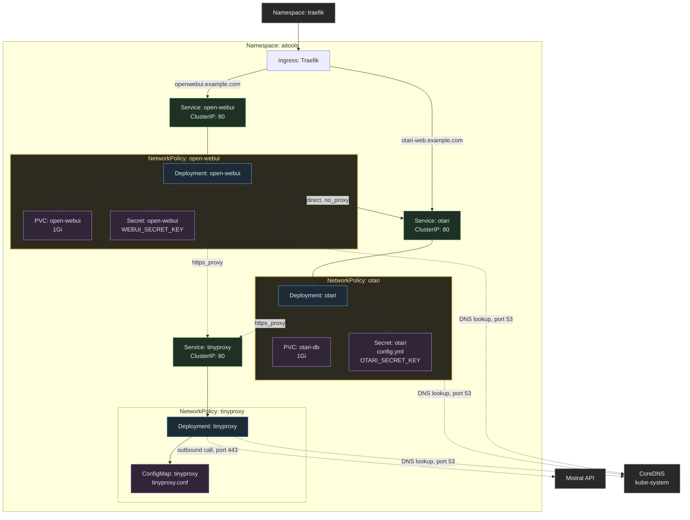
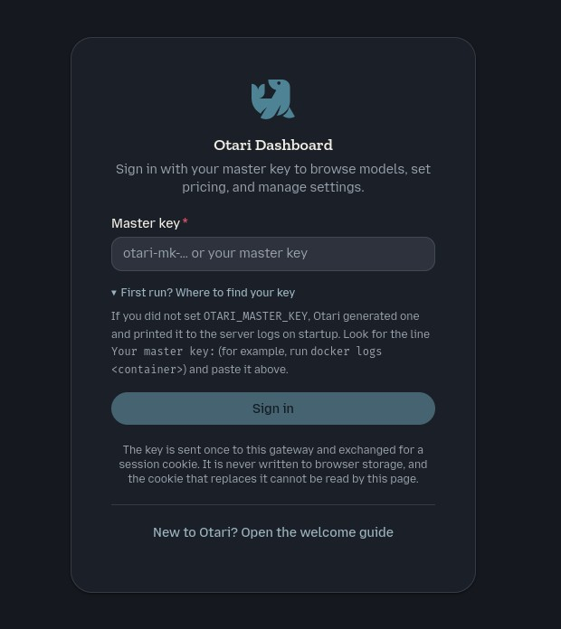
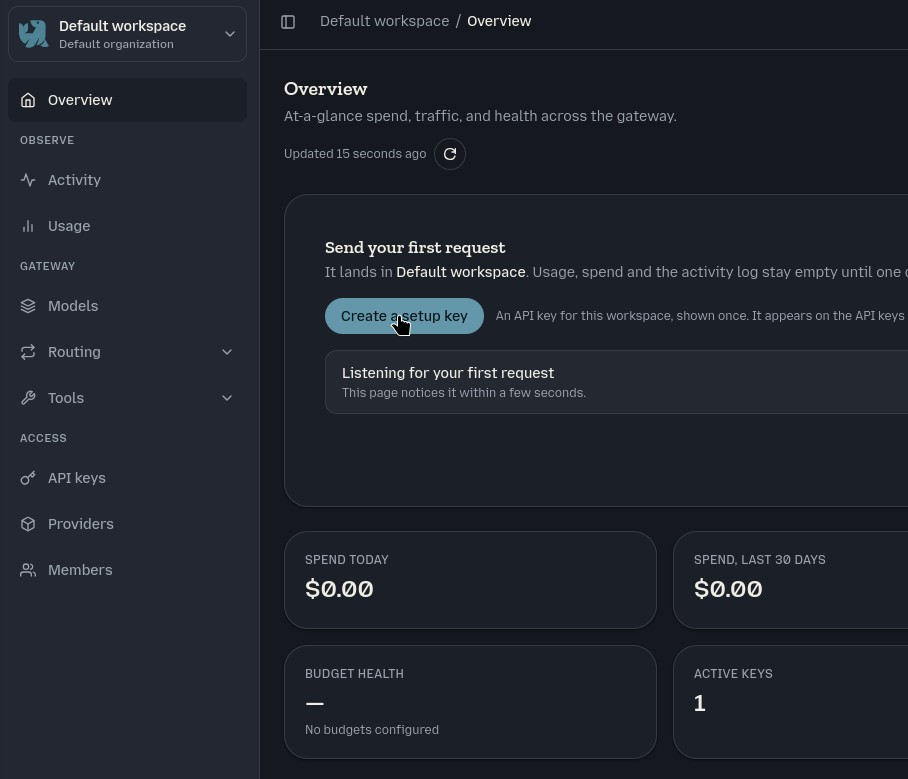
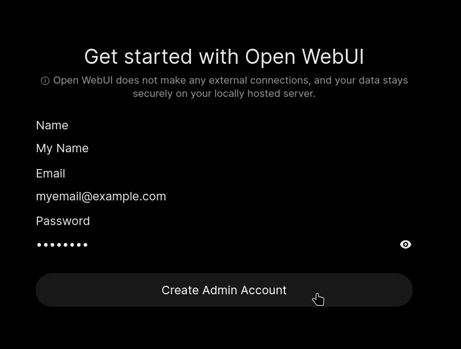
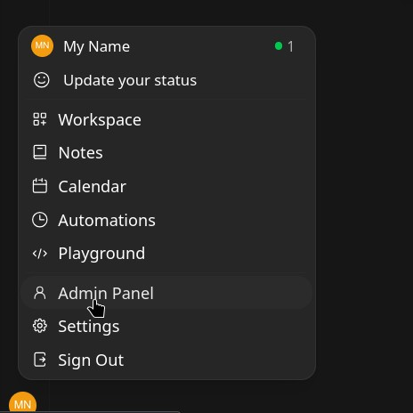
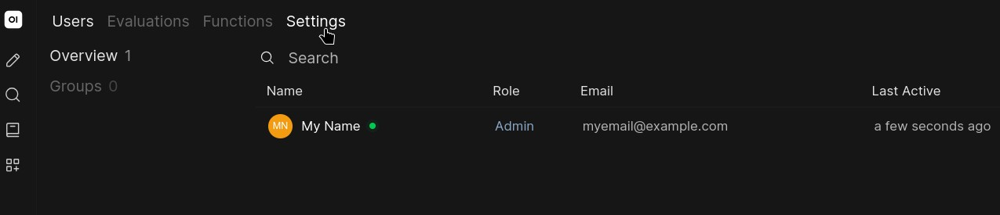
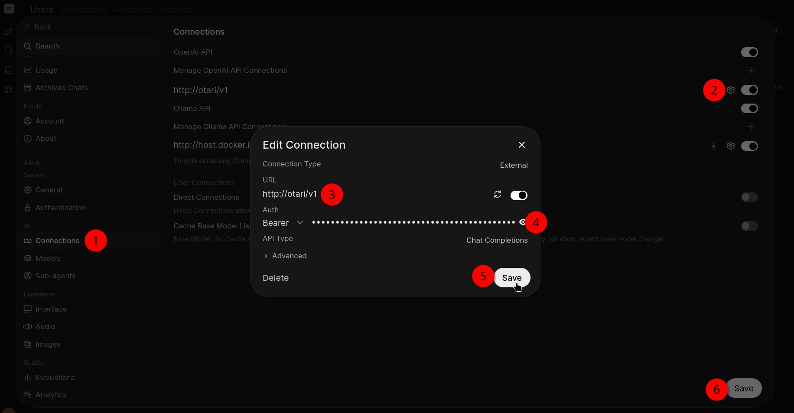
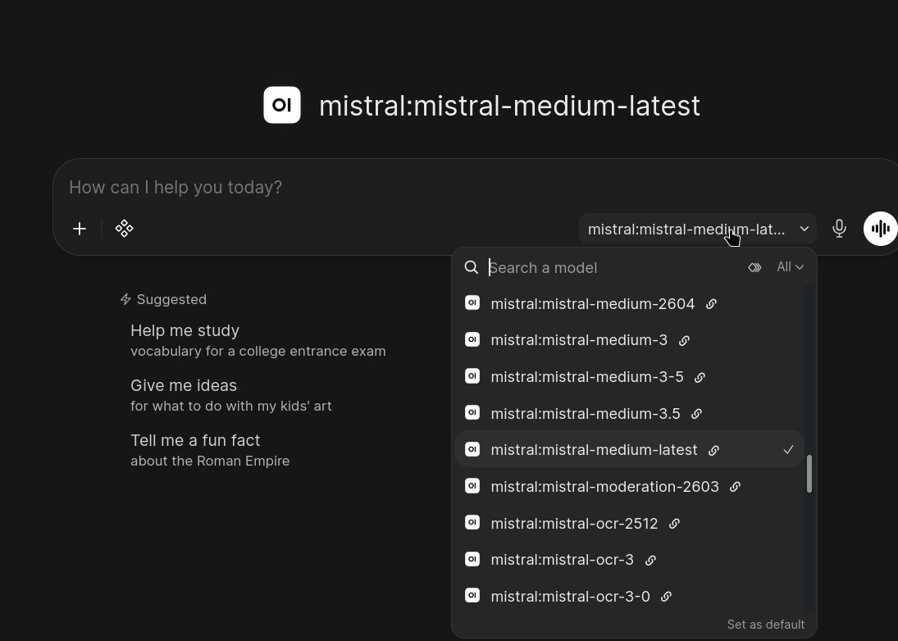
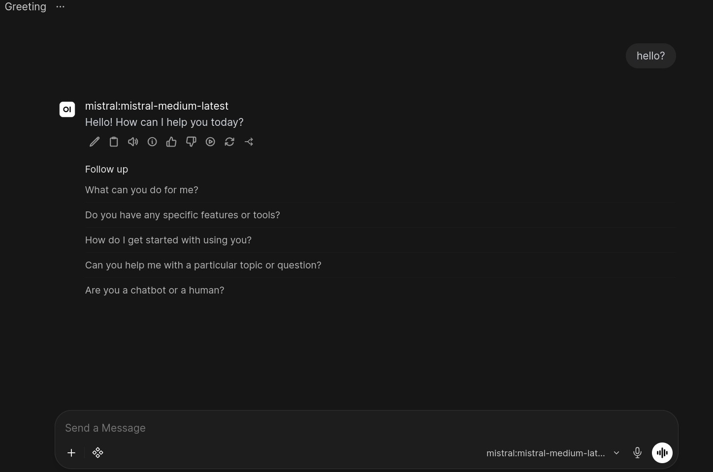

# Secure Otari + Open WebUI Kubernetes Setup

<!--toc:start-->
- [Secure Otari + Open WebUI Kubernetes Setup](#secure-otari-open-webui-kubernetes-setup)
  - [Requirements](#requirements)
  - [Architecture Overview](#architecture-overview)
  - [Setting up the Kubernetes objects](#setting-up-the-kubernetes-objects)
    - [Namespace config](#namespace-config)
    - [Persistent Storage](#persistent-storage)
      - [Otari Database PVC](#otari-database-pvc)
      - [Open WebUI PVC](#open-webui-pvc)
    - [Deployments](#deployments)
      - [Otari Deployment](#otari-deployment)
      - [Open WebUI Deployment](#open-webui-deployment)
      - [Tinyproxy Deployment](#tinyproxy-deployment)
    - [Services](#services)
      - [Otari Service](#otari-service)
      - [Open WebUI Service](#open-webui-service)
      - [Tinyproxy Service](#tinyproxy-service)
    - [Network Policies](#network-policies)
      - [Otari Network Policy](#otari-network-policy)
      - [Open WebUI Network Policy](#open-webui-network-policy)
      - [Tinyproxy Network Policy](#tinyproxy-network-policy)
    - [Ingress](#ingress)
      - [Otari Ingress](#otari-ingress)
      - [Open WebUI Ingress](#open-webui-ingress)
    - [Kustomization](#kustomization)
  - [Initial Deployment Steps](#initial-deployment-steps)
  - [Setup Otari connection in Open WebUI](#setup-otari-connection-in-open-webui)
    - [1. Create an API key in Otari](#1-create-an-api-key-in-otari)
    - [2. Create the admin account in Open WebUI](#2-create-the-admin-account-in-open-webui)
    - [3. Add the Otari connection](#3-add-the-otari-connection)
    - [4. Verify](#4-verify)
  - [Next steps](#next-steps)
<!--toc:end-->

[**Otari**](https://github.com/mozilla-ai/otari) is "an OpenAI-compatible LLM gateway you own and run yourself."

[**Open WebUI**](https://github.com/open-webui/open-webui) is "an extensible, feature-rich, and user-friendly self-hosted AI platform"

This easy guide will show how to have both of them installed and configured securely in a k8s cluster, using the self-hosted k3s distribution as an example.

Applied security features:

- network policies together with tinyproxy for connection logging and allowing only outbound https (port 443),
- read-only pods with volumes for storing persistent data,
- non-root UID/GID,
- custom SELinux MCS labels,
- default seccomp profile (`RuntimeDefault`) and dropped Linux capabilities,
- sensitive values kept in Kubernetes Secrets,
- memory limits.

______________________________________________________________________

## Requirements

- Kubernetes cluster with:
  - Storage provider to assign volumes using PersistentVolumeClaim.
  - Ingress, like [Traefik](https://doc.traefik.io/).
  - CNI plugin supporting NetworkPolicies (k3s provides one by default).
  - **SELinux** support (for pod security contexts; the `seLinuxOptions` levels in the manifests are cluster-specific examples, ignored on nodes without SELinux enforcing).
- `kubectl` configured to access the cluster.
- Domain names for Otari (`otari-web.example.com`) and Open WebUI (`openwebui.example.com`).

______________________________________________________________________

## Architecture Overview



______________________________________________________________________

## Setting up the Kubernetes objects

This section describes all the Kubernetes object definitions required to
make the apps up and running, with proper configuration.

### Namespace config

First we create the namespace, where most of the Kubernetes objects will be placed.

File: [`namespace.yaml`](./objects/namespace.yaml)

```yaml
apiVersion: v1
kind: Namespace
metadata:
  name: aitools
```

______________________________________________________________________

### Persistent Storage

To store data persistently, we will create two volumes using PersistentVolumeClaim objects with proper storage classes. On my cluster there is [Longhorn](https://longhorn.io/) deployed with custom storage classes configured. Which storage class you need to choose depends on your k8s cluster. See what you have available with `kubectl get storageclasses.storage.k8s.io`.

#### Otari Database PVC

File: [`pvc-otari-db.yaml`](./objects/pvc-otari-db.yaml)

```yaml
apiVersion: v1
kind: PersistentVolumeClaim
metadata:
  name: otari-db
  namespace: aitools
spec:
  accessModes:
  - ReadWriteOnce
  storageClassName: longhorn-crypto-fast
  resources:
    requests:
      storage: 1Gi
```

- Stores SQLite database (`/data/otari.db`) for Otari.

______________________________________________________________________

#### Open WebUI PVC

File: [`pvc-open-webui.yaml`](./objects/pvc-open-webui.yaml)

```yaml
apiVersion: v1
kind: PersistentVolumeClaim
metadata:
  name: open-webui
  namespace: aitools
spec:
  accessModes:
  - ReadWriteOnce
  storageClassName: longhorn-crypto-fast
  resources:
    requests:
      storage: 1Gi
```

- Storage for user data, cache, and static files.
- Mounted at `/app/backend/data`.

______________________________________________________________________

### Deployments

Then we can prepare definitions of our deployments of Otari, Open WebUI and tinyproxy.

#### Otari Deployment

File: [`deployment-otari.yaml`](./objects/deployment-otari.yaml)

```yaml
apiVersion: apps/v1
kind: Deployment
metadata:
  name: otari
  namespace: aitools
spec:
  # Recreate: RWO volume cannot attach to two pods on different nodes during a rolling update
  strategy:
    type: Recreate
  selector:
    matchLabels:
      app.kubernetes.io/name: otari
  template:
    metadata:
      labels:
        app.kubernetes.io/name: otari
    spec:
      securityContext:
        runAsNonRoot: true
        runAsUser: 12906
        runAsGroup: 12906
        fsGroup: 12906
        seLinuxOptions:
          level: "s0:c262,c830"
        seccompProfile:
          type: RuntimeDefault
      containers:
      - name: otari
        image: docker.io/mzdotai/otari:latest # if you want more stable experience, set tag to selected version
        imagePullPolicy: Always
        command:
        - otari
        - serve
        - --config
        - /app/config.yml
        env:
        # Kubernetes injects OTARI_PORT=tcp://<otari-svc-ip>:80 into the container env
        # (service links derived from the otari Service); Otari reads it as its port
        # override, so pin the real port explicitly - explicit env wins over injected
        - name: OTARI_PORT
          value: "8000"
        - name: http_proxy
          value: "http://tinyproxy.aitools.svc.cluster.local.:80"
        - name: https_proxy
          value: "http://tinyproxy.aitools.svc.cluster.local.:80"
        - name: OTARI_SECRET_KEY
          valueFrom:
            secretKeyRef:
              name: otari
              key: OTARI_SECRET_KEY
        resources:
          requests:
            memory: "500Mi"
          limits:
            memory: "600Mi"
        securityContext:
          readOnlyRootFilesystem: true
          allowPrivilegeEscalation: false
          capabilities:
            drop:
            - ALL
        livenessProbe:
          httpGet:
            path: /health/liveness
            port: 8000
          initialDelaySeconds: 5
          periodSeconds: 15
          timeoutSeconds: 5
        readinessProbe:
          httpGet:
            path: /health/readiness
            port: 8000
          initialDelaySeconds: 10
          periodSeconds: 10
          timeoutSeconds: 5
        volumeMounts:
          - mountPath: /data/
            name: data
          - mountPath: /app/config.yml
            subPath: config.yml
            name: config
      volumes:
      - name: config
        secret:
          secretName: otari
      - name: data
        persistentVolumeClaim:
          claimName: otari-db
```

- **Security Context**:
  - Runs as non-root user (`12906` - arbitrary non-root UID; `fsGroup` grants write access to mounted volumes).
  - Custom SELinux context (`s0:c262,c830`) for mandatory access control. The MCS (Multi-Category Security) categories were picked randomly here - similar to what Podman or Docker do by default, when they assign a random category pair to every container, which prevents pods from accessing each other's stuff (files, volumes). On nodes without SELinux enforcing these options are ignored, while on enforcing clusters you should pick your own unique categories per app.
  - If your k8s distribution handles SELinux labeling in a more organized way (e.g., assigning unique MCS levels per pod automatically, like OpenShift), you might want or need to adjust this configuration instead of hardcoding it.
  - Read-only root filesystem.
  - Default seccomp profile (`RuntimeDefault`) and all Linux capabilities dropped.
- **Configuration**:
  - Mounts `config.yml` from a Kubernetes `Secret` (see [`kustomization.yaml`](#kustomization)).
  - Listens on unprivileged port `8000`, pinned via the explicit `OTARI_PORT` env entry: Kubernetes injects a `OTARI_PORT=tcp://<otari-service-ip>:80` variable into the container (service environment links derived from the `otari` Service name), which Otari would otherwise pick up as its listen port - an explicit env entry overrides the injected one, and would fail, since this is a whole address, not just port (integer). 
   - The master key (root-level access to Otari) is not preconfigured: on first startup Otari generates it automatically, persists its hash, and prints the plaintext **once** to the pod logs. Read and save it right after the first deployment (`kubectl -n aitools logs deployment/otari`) - it is required to sign in to the dashboard and keeps working across pod restarts.
   - Unlike the master key, the `OTARI_SECRET_KEY` is **not** generated by Otari - you set it yourself in the `otari` Secret (see [`kustomization.yaml`](#kustomization)). It is a Fernet key used to encrypt-at-rest provider credentials and search-tool keys added later through the dashboard: without it, storing those credentials fails, and losing it makes already-stored ones undecryptable. Generate your own with `docker run --rm docker.io/mzdotai/otari:latest otari gen-secret-key` and keep a backup separate from the database.
  - The automatic bootstrap API key is disabled (`bootstrap_api_key: false` in the config) - otherwise Otari would additionally create a ready-to-use client API key on first startup and print it to the logs. Client API keys are created deliberately via the dashboard instead (see [Setup Otari connection in Open WebUI](#setup-otari-connection-in-open-webui)).
  - Uses `tinyproxy` for outbound traffic (e.g., to the Mistral API); Open WebUI connects to Otari directly, bypassing tinyproxy thanks to its `no_proxy` setting.
- **Storage**:
  - SQLite database stored in `/data/` (backed by `otari-db` PVC).

**Otari Config** (`otari/config.yml`) (deployed via Kustomization, later in the guide):

```yaml
# Configuration for otari-gateway

# Database connection URL
database_url: "sqlite:////data/otari.db"

host: "0.0.0.0"

# Do not create a client API key automatically on first startup
bootstrap_api_key: false

require_pricing: false
providers:
  mistral:
    api_key: changeme
```

______________________________________________________________________

#### Open WebUI Deployment

File: [`deployment-open-webui.yaml`](./objects/deployment-open-webui.yaml)

```yaml
apiVersion: apps/v1
kind: Deployment
metadata:
  name: open-webui
  namespace: aitools
spec:
  # Recreate: RWO volume cannot attach to two pods on different nodes during a rolling update
  strategy:
    type: Recreate
  selector:
    matchLabels:
      app.kubernetes.io/name: open-webui
  template:
    metadata:
      labels:
        app.kubernetes.io/name: open-webui
    spec:
      securityContext:
        runAsNonRoot: true
        runAsUser: 14587
        runAsGroup: 14587
        fsGroup: 14587
        seLinuxOptions:
          level: "s0:c363,c784"
        seccompProfile:
          type: RuntimeDefault
      containers:
      - name: open-webui
        image: ghcr.io/open-webui/open-webui:v0.11.0
        imagePullPolicy: Always
        resources:
          requests:
            memory: "3072Mi"
          limits:
            memory: "3072Mi"
        securityContext:
          readOnlyRootFilesystem: true
          allowPrivilegeEscalation: false
          capabilities:
            drop:
            - ALL
        livenessProbe:
          httpGet:
            path: /health
            port: 8080
          initialDelaySeconds: 60
          periodSeconds: 30
          timeoutSeconds: 5
          failureThreshold: 5
        readinessProbe:
          httpGet:
            path: /health
            port: 8080
          initialDelaySeconds: 30
          periodSeconds: 10
          timeoutSeconds: 5
          failureThreshold: 6
        env:
        - name: http_proxy
          value: "http://tinyproxy.aitools.svc.cluster.local.:80"
        - name: https_proxy
          value: "http://tinyproxy.aitools.svc.cluster.local.:80"
        - name: no_proxy
          value: "localhost,127.0.0.1,::1,otari,.cluster.local"
        - name: NO_PROXY
          value: "localhost,127.0.0.1,::1,otari,.cluster.local"
        - name: WEBUI_SECRET_KEY
          valueFrom:
            secretKeyRef:
              name: open-webui
              key: WEBUI_SECRET_KEY
        volumeMounts:
          - mountPath: /app/backend/data
            name: data
          - mountPath: /app/backend/open_webui/static/
            name: static
          - mountPath: /app/backend/data/cache
            name: cache
          - mountPath: /tmp
            name: tmp
      volumes:
      - name: data
        persistentVolumeClaim:
          claimName: open-webui
      - name: static
        emptyDir: {}
      - name: tmp
        emptyDir: {}
      - name: cache
        emptyDir: {}
```

Set your private `WEBUI_SECRET_KEY` (a random string) as a literal of the generated `open-webui` Secret - see [`kustomization.yaml`](./objects/kustomization.yaml). The key is injected into the container environment with `secretKeyRef`, as shown in the Deployment above.

- **Security Context**:
  - Again non-root user (with UID and GID set to arbitrary number `14587`) with SELinux (`s0:c363,c784`).
  - Read-only root filesystem.
  - Default seccomp profile (`RuntimeDefault`) and all Linux capabilities dropped.
- External traffic is routed through `tinyproxy` via the `http_proxy`/`https_proxy` variables. The `no_proxy`/`NO_PROXY` variables exempt localhost and `.cluster.local` hosts, so internal connections to Otari (`http://otari/v1`) are made directly, without the proxy. The bare `otari` entry (without a domain suffix) is there because that is the short name you will enter in the Open WebUI connection URL — Kubernetes DNS resolves it to the full `otari.aitools.svc.cluster.local` FQDN within the same namespace. The `.cluster.local` entry covers the FQDN form in case the full address is used instead.
- **Storage**:
  - Persistent volume for user data (`/app/backend/data`).
  - Ephemeral volumes (`static`, `cache`, `tmp`) exist because the container runs with a read-only root filesystem and needs writable directories: Open WebUI rewrites its bundled static assets under `/app/backend/open_webui/static/` on every startup, writes temporary files to `/tmp`, and downloads models into `/app/backend/data/cache`.
  - The `cache` mount intentionally shadows the `cache` subdir of the persistent volume, keeping downloaded model caches off the PVC (they are reproducible and would fill it quickly).

______________________________________________________________________

#### Tinyproxy Deployment

The last deployment is the tinyproxy, which can control which domains both Otari and Open WebUI can connect to. With our config we don't set a whitelist of allowed domains. Still, we gain logs of each outbound connection, and restrict access to https (port 443) only.

File: [`deployment-tinyproxy.yaml`](./objects/deployment-tinyproxy.yaml)

```yaml
apiVersion: apps/v1
kind: Deployment
metadata:
  name: tinyproxy
  namespace: aitools
spec:
  selector:
    matchLabels:
      app.kubernetes.io/name: tinyproxy
  template:
    metadata:
      labels:
        app.kubernetes.io/name: tinyproxy
    spec:
      securityContext:
        runAsNonRoot: true
        runAsUser: 34439
        runAsGroup: 34439
        fsGroup: 34439
        seLinuxOptions:
          level: "s0:c563,c777"
        seccompProfile:
          type: RuntimeDefault
      containers:
      - name: tinyproxy
        resources:
          requests:
            memory: "20Mi"
          limits:
            memory: "80Mi"
        image: ajoergensen/tinyproxy:latest
        imagePullPolicy: Always
        securityContext:
          readOnlyRootFilesystem: true
          allowPrivilegeEscalation: false
          capabilities:
            drop:
            - ALL
        livenessProbe:
          tcpSocket:
            port: 8888
          initialDelaySeconds: 5
          periodSeconds: 15
          timeoutSeconds: 5
        readinessProbe:
          tcpSocket:
            port: 8888
          initialDelaySeconds: 5
          periodSeconds: 10
          timeoutSeconds: 5
        volumeMounts:
          - mountPath: /tmp
            name: tmp
          - mountPath: /var/run
            name: varrun
          - name: conf
            mountPath: "/etc/tinyproxy"
            readOnly: true
      volumes:
      - name: conf
        configMap:
          name: tinyproxy
      - name: tmp
        emptyDir: {}
      - name: varrun
        emptyDir:
          medium: Memory
```

- **Security Context**:
  - Non-root user (`34439`) with SELinux (`s0:c563,c777`).
  - Read-only root filesystem.
  - Default seccomp profile (`RuntimeDefault`) and all Linux capabilities dropped.
- **Configuration**:
  - Mounts `tinyproxy.conf` from a `ConfigMap` (see [`kustomization.yaml`](#kustomization)).
  - Ephemeral volumes for `/tmp` and `/var/run`.
- **Connection logging**: with `LogLevel Connect`, every proxied connection is logged to stdout - inspect with `kubectl -n aitools logs deployment/tinyproxy`.

**Basic Tinyproxy Config** (`tinyproxy/tinyproxy.conf`) (again, deployed via Kustomization later on):

```
Port 8888
Timeout 600
LogLevel Connect
PidFile "/tmp/tinyproxy.pid"
MaxClients 100
DisableViaHeader Yes
ConnectPort 443
```

You can extend it to set up a whitelist of allowed domains. More at https://tinyproxy.github.io/

______________________________________________________________________

### Services

Services are an abstraction layer controlling how connections are made to (sets of) pods. By default we should use the ClusterIP type, which assigns an internal IP to the service backed by the pods.
In this setup we assume only IPv4 is available in the cluster.

#### Otari Service

File: [`service-otari.yaml`](./objects/service-otari.yaml)

```yaml
apiVersion: v1
kind: Service
metadata:
  name: otari
  namespace: aitools
spec:
  type: ClusterIP
  selector:
    app.kubernetes.io/name: otari
  ipFamilyPolicy: SingleStack
  ipFamilies:
  - IPv4
  ports:
    - protocol: TCP
      port: 80
      targetPort: 8000
```

- Exposes Otari on port `80` (Otari listens on its default unprivileged port `8000`).

______________________________________________________________________

#### Open WebUI Service

File: [`service-open-webui.yaml`](./objects/service-open-webui.yaml)

```yaml
apiVersion: v1
kind: Service
metadata:
  name: open-webui
  namespace: aitools
spec:
  type: ClusterIP
  selector:
    app.kubernetes.io/name: open-webui
  ipFamilyPolicy: SingleStack
  ipFamilies:
  - IPv4
  ports:
    - protocol: TCP
      port: 80
      targetPort: 8080
```

- Exposes Open WebUI on port `80` (Open WebUI listens, by default, on `8080`).

______________________________________________________________________

#### Tinyproxy Service

File: [`service-tinyproxy.yaml`](./objects/service-tinyproxy.yaml)

```yaml
apiVersion: v1
kind: Service
metadata:
  name: tinyproxy
  namespace: aitools
spec:
  type: ClusterIP
  selector:
    app.kubernetes.io/name: tinyproxy
  ipFamilyPolicy: SingleStack
  ipFamilies:
  - IPv4
  ports:
    - protocol: TCP
      port: 80
      targetPort: 8888
```

- Exposes Tinyproxy on port `80` (target: `8888`).

______________________________________________________________________

### Network Policies

Before we open our apps to the Internet or some other network, we should finish setting up security. Therefore we proceed with limiting network access using Network Policies. This assumes your k8s cluster runs a CNI plugin with NetworkPolicy support - k3s ships Flannel by default, with kube-router's network policy controller handling enforcement.

#### Otari Network Policy

File: [`network-policy-otari.yaml`](./objects/network-policy-otari.yaml)

```yaml
apiVersion: networking.k8s.io/v1
kind: NetworkPolicy
metadata:
  name: otari
  namespace: aitools
spec:
  podSelector:
    matchLabels:
      app.kubernetes.io/name: otari
  policyTypes:
    - Ingress
    - Egress
  ingress:
    - from:
      - namespaceSelector:
          matchLabels:
            kubernetes.io/metadata.name: traefik
      - namespaceSelector:
          matchLabels:
            kubernetes.io/metadata.name: aitools
      ports:
      - protocol: TCP
        port: 8000
  egress:
    - to:
      - podSelector:
          matchLabels:
            app.kubernetes.io/name: tinyproxy
      ports:
      - protocol: TCP
        port: 8888
    - to:
      - namespaceSelector:
          matchLabels:
            kubernetes.io/metadata.name: kube-system
      ports:
      - protocol: UDP
        port: 53
      - protocol: TCP
        port: 53
```

- **Ingress**: Allows traffic from:
  - Traefik namespace (for ingress).
  - `aitools` namespace (for internal communication).
- **Egress**: Allows direct traffic only to Tinyproxy, and to the `kube-system` namespace to access DNS (deployed there in my cluster).

______________________________________________________________________

#### Open WebUI Network Policy

File: [`network-policy-open-webui.yaml`](./objects/network-policy-open-webui.yaml)

```yaml
apiVersion: networking.k8s.io/v1
kind: NetworkPolicy
metadata:
  name: open-webui
  namespace: aitools
spec:
  podSelector:
    matchLabels:
      app.kubernetes.io/name: open-webui
  policyTypes:
    - Ingress
    - Egress
  ingress:
    - from:
      - namespaceSelector:
          matchLabels:
            kubernetes.io/metadata.name: traefik
      ports:
      - protocol: TCP
        port: 8080
  egress:
    - to:
      - podSelector:
          matchLabels:
            app.kubernetes.io/name: tinyproxy
      ports:
      - protocol: TCP
        port: 8888
    - to:
      - podSelector:
          matchLabels:
            app.kubernetes.io/name: otari
      ports:
      - protocol: TCP
        port: 8000
    - to:
      - namespaceSelector:
          matchLabels:
            kubernetes.io/metadata.name: kube-system
      ports:
      - protocol: UDP
        port: 53
      - protocol: TCP
        port: 53
```

- **Ingress**: Allows traffic only from Traefik namespace.
- **Egress**: Restricts outbound traffic to:
  - Tinyproxy (port `8888`) for external https calls.
  - Otari directly (port `8000`) - internal chat requests bypass the proxy (`no_proxy`).
  - Kubernetes DNS (port `53`).

______________________________________________________________________

#### Tinyproxy Network Policy

File: [`network-policy-tinyproxy.yaml`](./objects/network-policy-tinyproxy.yaml)

```yaml
apiVersion: networking.k8s.io/v1
kind: NetworkPolicy
metadata:
  name: tinyproxy
  namespace: aitools
spec:
  podSelector:
    matchLabels:
      app.kubernetes.io/name: tinyproxy
  policyTypes:
    - Ingress
    - Egress
  ingress:
    - from:
      - namespaceSelector:
          matchLabels:
            kubernetes.io/metadata.name: aitools
      ports:
      - protocol: TCP
        port: 8888
  egress:
    - to:
      - ipBlock:
          cidr: 0.0.0.0/0
      ports:
      - protocol: TCP
        port: 443
    - to:
      - namespaceSelector:
          matchLabels:
            kubernetes.io/metadata.name: kube-system
      ports:
      - protocol: UDP
        port: 53
      - protocol: TCP
        port: 53
```

- **Ingress**: Allows connections only from pods in the `aitools` namespace (Otari and Open WebUI), on the proxy port `8888`.
- **Egress**: Restricts outbound traffic to:
  - Any destination on port `443` (matching `ConnectPort 443` in `tinyproxy.conf`).
  - Kubernetes DNS (port `53`) in the `kube-system` namespace.

______________________________________________________________________

### Ingress

Finally we can make our deployed apps available outside the cluster, using ingress.

**TLS note**: the example Ingresses below contain no `tls:` section. This guide assumes your Traefik installation serves a default certificate that matches the Ingress domains. If that is not your case, add a `tls:` block (and provision certificates, e.g. with cert-manager) according to your setup.

**Important note**: example below opens the apps on default websecure entrypoint, without any middlewares. That could mean potentially opening it to the Internet, depending on your setup. This guide cannot provide any more secure setup, because changing (and preparing) a more restricted entrypoint, and setting up the IPAllowList middleware, depends on your custom k8s cluster setup and surroundings.

For more secure setup consult Traefik docs, or any other ingress docs if not using Traefik.

How to setup IPAllowList middleware for additionally restricted ingress access: [*IPAllowList*](https://doc.traefik.io/traefik/reference/routing-configuration/http/middlewares/ipallowlist/).

Remember to add proper annotation on the Ingress, something like:

```yaml
apiVersion: networking.k8s.io/v1
kind: Ingress
metadata:
  name: open-webui
  namespace: aitools
  annotations:
    traefik.ingress.kubernetes.io/router.entrypoints: websecure
    traefik.ingress.kubernetes.io/router.middlewares: traefik-vpn-whitelist@kubernetescrd
```

#### Otari Ingress

File: [`ingress-otari.yaml`](./objects/ingress-otari.yaml)

```yaml
apiVersion: networking.k8s.io/v1
kind: Ingress
metadata:
  name: otari
  namespace: aitools
  annotations:
    traefik.ingress.kubernetes.io/router.entrypoints: websecure
spec:
  ingressClassName: traefik
  rules:
  - host: otari-web.example.com
    http:
      paths:
      - path: /
        pathType: Prefix
        backend:
          service:
            name: otari
            port:
              number: 80
```

- Routes `otari-web.example.com` to the Otari service.
- Uses Traefik with the `websecure` entrypoint (default https entrypoint in traefik deployments).
- The file itself defines no middleware - the `vpn-whitelist` middleware from the example above (restricts access to VPN IPs) has to be added manually.

______________________________________________________________________

#### Open WebUI Ingress

File: [`ingress-open-webui.yaml`](./objects/ingress-open-webui.yaml)

```yaml
apiVersion: networking.k8s.io/v1
kind: Ingress
metadata:
  name: open-webui
  namespace: aitools
  annotations:
    traefik.ingress.kubernetes.io/router.entrypoints: websecure
spec:
  ingressClassName: traefik
  rules:
  - host: openwebui.example.com
    http:
      paths:
      - path: /
        pathType: Prefix
        backend:
          service:
            name: open-webui
            port:
              number: 80
```

- Routes `openwebui.example.com` to the Open WebUI service.
- Same setup as Otari - add the whitelist middleware annotation yourself for VPN-only access.

______________________________________________________________________

### Kustomization

For convenient deployment and easier management of config files we can use a kustomization file. It creates the Otari and Open WebUI Secrets and the Tinyproxy ConfigMap from generator entries, which are much easier to edit.

File: [`kustomization.yaml`](./objects/kustomization.yaml)

```yaml
apiVersion: kustomize.config.k8s.io/v1beta1
kind: Kustomization
namespace: aitools

resources:
- ./namespace.yaml
- ./network-policy-otari.yaml
- ./network-policy-open-webui.yaml
- ./network-policy-tinyproxy.yaml
- ./pvc-open-webui.yaml
- ./pvc-otari-db.yaml
- ./service-otari.yaml
- ./service-tinyproxy.yaml
- ./service-open-webui.yaml
- ./ingress-otari.yaml
- ./ingress-open-webui.yaml
- ./deployment-tinyproxy.yaml
- ./deployment-otari.yaml
- ./deployment-open-webui.yaml

configMapGenerator:
- name: tinyproxy
  files:
  - ./tinyproxy/tinyproxy.conf
secretGenerator:
- name: otari
  files:
  - ./otari/config.yml
  literals:
  # replace with your own Fernet key, e.g.: docker run --rm docker.io/mzdotai/otari:latest otari gen-secret-key
  - OTARI_SECRET_KEY=changeme
# replace with your own random string
- name: open-webui
  literals:
  - WEBUI_SECRET_KEY=changeme
generatorOptions:
  disableNameSuffixHash: true
```

- **ConfigMapGenerator**: Creates a `ConfigMap` for Tinyproxy configuration.
- **SecretGenerator**: Creates both Secrets from generator entries: the Otari `Secret` (`config.yml` file plus the `OTARI_SECRET_KEY` literal, consumed by the Otari Deployment) and the Open WebUI `Secret` (`WEBUI_SECRET_KEY` literal, consumed by the Open WebUI Deployment via `secretKeyRef`).
- **generatorOptions** (`disableNameSuffixHash: true`): keeps generated object names stable (no hash suffix). Caveat: changing `tinyproxy.conf`, `config.yml`, or the `OTARI_SECRET_KEY` entry does not automatically restart the Deployments - after applying changes run `kubectl -n aitools rollout restart deployment/tinyproxy deployment/otari`.

______________________________________________________________________

## Initial Deployment Steps

1. Customize/configure the files to your setup and secrets

   - [Otari config](./objects/otari/config.yml)
   - `OTARI_SECRET_KEY` literal in the [Kustomization](./objects/kustomization.yaml) - generate one with `docker run --rm docker.io/mzdotai/otari:latest otari gen-secret-key` (required to store provider credentials via the Otari dashboard)
   - `WEBUI_SECRET_KEY` literal in the [Kustomization](./objects/kustomization.yaml)
   - Ingress domains (change `otari-web.example.com`, `openwebui.example.com` to use your domains)
   - PVC storageClassName should be set to something you have available in your cluster, check with `kubectl get storageclasses.storage.k8s.io`

2. Apply the k8s objects to your cluster:

   ```bash
   kubectl apply -k ./objects
   ```

3. Verify Resources:

   ```bash
   kubectl get all -n aitools
   kubectl get pvc -n aitools
   ```

4. Save the Otari master key:

   On first startup Otari generates the master key automatically and prints it to the pod logs **exactly once**. Read it now and store it somewhere safe - it is required to sign in to the Otari dashboard later:

   ```bash
   kubectl -n aitools logs deployment/otari
   ```

   Note this applies to the master key only - the `OTARI_SECRET_KEY` is whatever you configured in the `otari` Secret; Otari never prints it.

5. Check the Services:

   - Otari: `https://otari-web.example.com`
   - Open WebUI: `https://openwebui.example.com`

______________________________________________________________________

## Setup Otari connection in Open WebUI

With both apps deployed and available under their domains, we can now connect Open WebUI to Otari and start chatting with the models exposed by the gateway.

### 1. Create an API key in Otari

Sign in to the Otari dashboard at `https://otari-web.example.com` using your Otari master key - generated automatically on first startup and saved from the pod logs ([Initial Deployment Steps](#initial-deployment-steps)):



On the Overview page, click **Create a setup key**. An API key for the workspace is generated and shown only once - copy it, you will need it for the connection setup:



### 2. Create the admin account in Open WebUI

Open `https://openwebui.example.com` and click **Get started**:


Fill in your name, email and password, and create the admin account (the first registered user becomes the administrator):



### 3. Add the Otari connection

Click your user name in the bottom-left corner and select **Admin Panel**:



In the Admin Panel, go to the **Settings** tab:



Then configure the connection (numbers refer to the screenshot):

1. Open **Connections** in the left sidebar.
1. Edit the existing OpenAI API connection (gear icon) or add a new one with **+**.
1. Set the URL to `http://otari/v1` — the short name is enough here because Kubernetes DNS resolves it to `otari.aitools.svc.cluster.local` within the same namespace. Thanks to the `no_proxy`/`NO_PROXY` environment variables this internal request bypasses tinyproxy and connects to Otari directly.
1. Set auth type to **Bearer** and paste the API key created in Otari.
1. **Save** the connection dialog.
1. **Save** the settings at the bottom-right.



### 4. Verify

Start a new chat and pick one of the models exposed by Otari, e.g. `mistral:mistral-medium-latest`:



Send a test message - if the model responds, the whole chain (Open WebUI -> Otari -> tinyproxy -> Mistral API) works:



## Next steps

- Add more hardening to your setup:
  - Traefik Middleware IPAllowList and separate local router entrypoint for limited access,
  - Domain whitelist in tinyproxy,
  - Setting `CORS_ALLOW_ORIGIN` in Open WebUI.
- Set `require_pricing: true` in [Otari config](./objects/otari/config.yml) for fail-closed cost accounting - requests for models without configured pricing are then rejected (HTTP 402). Optionally also enable `default_pricing: true` to auto-price models from the bundled genai-prices dataset
- Adjust resource requests/limits and PVC sizes to your real usage
- Consider updating the images to newest tags.
